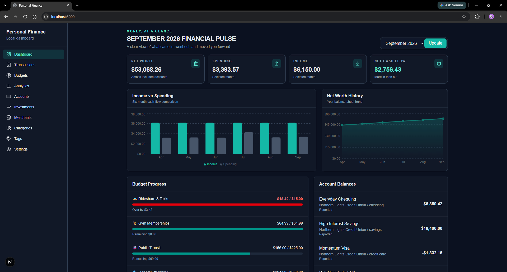
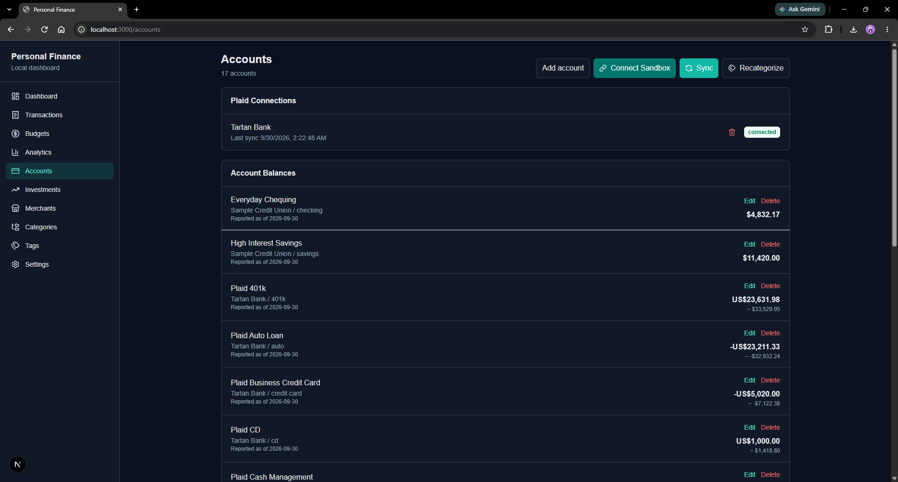
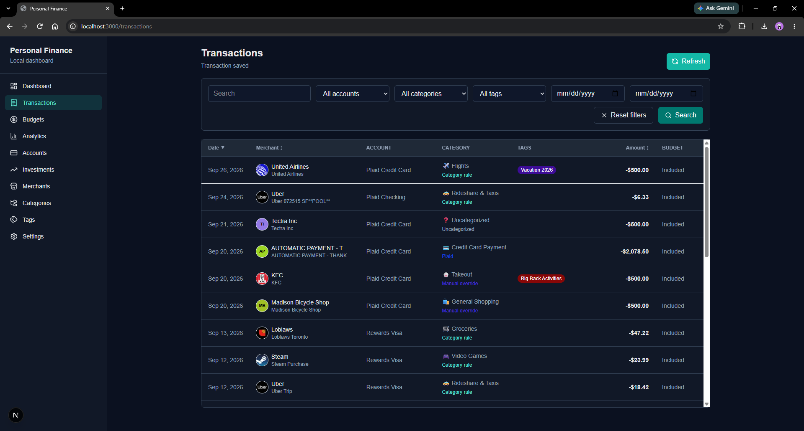
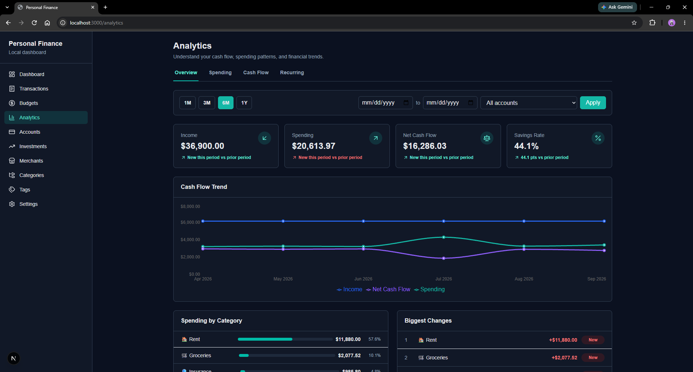
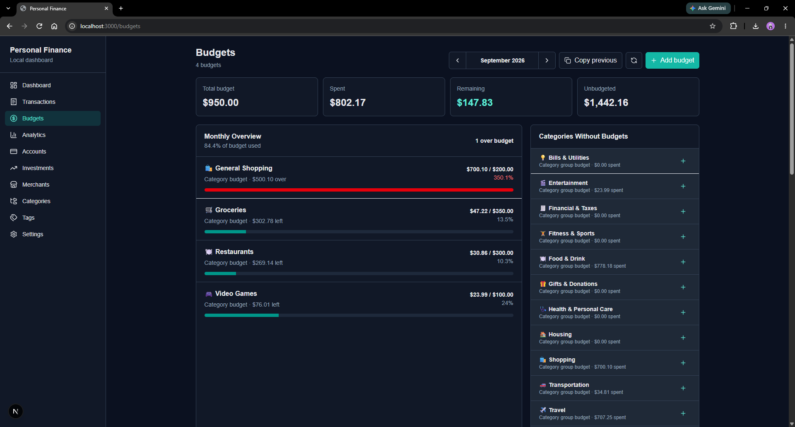
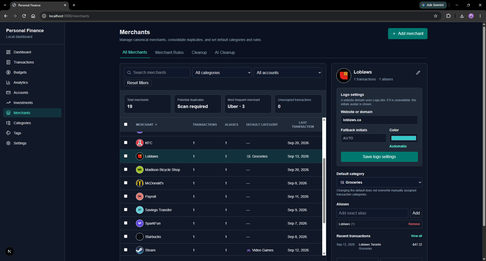
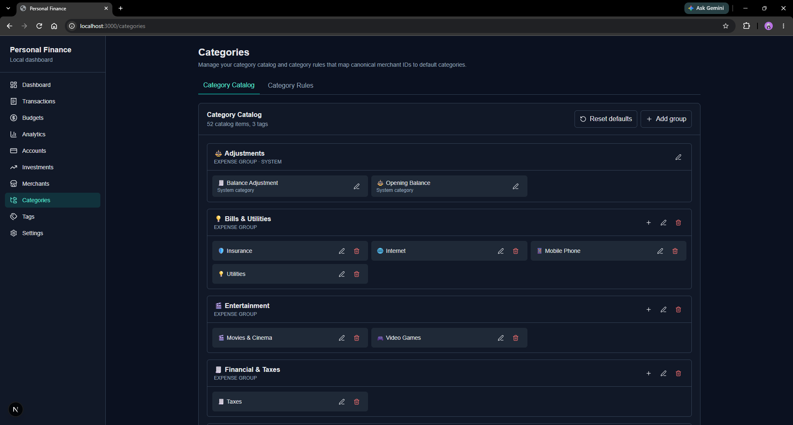
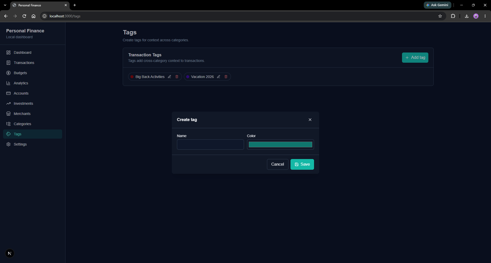
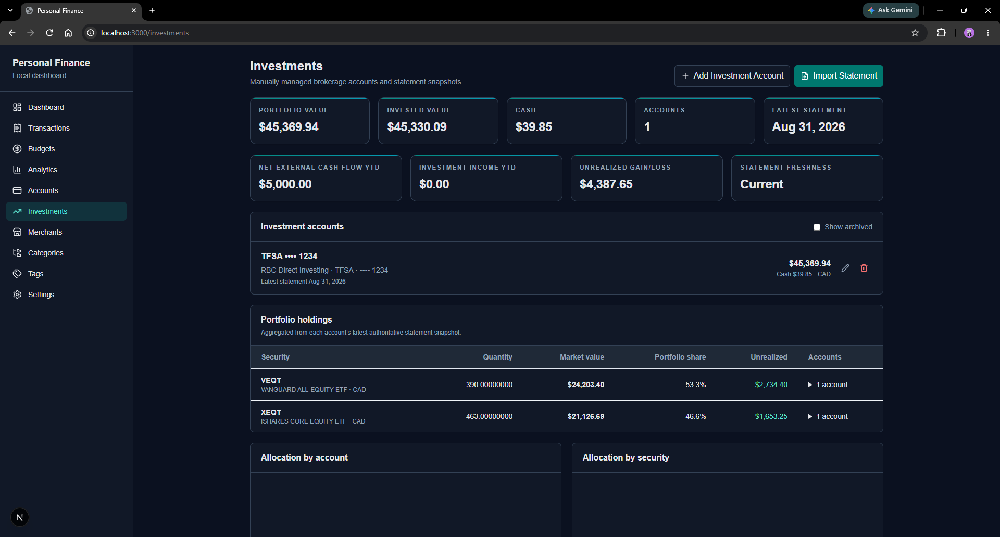
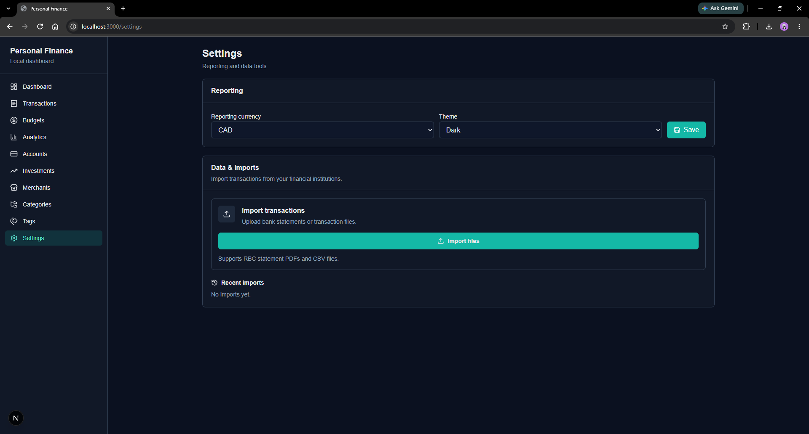

# Personal Finance App

> **Welcome to the public showcase repository!** The production source is currently private and actively under development.
> 
> Suggestions and feedback are always welcome. 😊

A **local-first personal finance platform** for tracking accounts, transactions, budgets, recurring expenses, investments, and financial analytics.

Built as a modern replacement for the personal-finance workflows I previously relied on in Intuit's Mint budgeting app (rest in peace), with an emphasis on data ownership, automation, and useful financial insights.

---

## Demo



The dashboard combines account balances, net worth, monthly spending, income, cash flow, budget progress, historical trends, and recent transactions into a single financial overview.

---

## What It Does

- Aggregates bank accounts and transactions through **Plaid**
- Imports transaction history from **RBC monthly statement PDFs**
- Imports **RBC Direct Investing** statements and portfolio data
- Normalizes raw transaction descriptions into canonical merchants
- Automatically categorizes transactions using deterministic rules
- Supports custom categories, category groups, tags, and merchant rules
- Tracks monthly budgets and budget utilization
- Detects recurring transactions such as subscriptions, bills, rent, and income
- Calculates net worth across assets and liabilities
- Supports multi-currency financial reporting
- Provides spending, cash-flow, savings-rate, merchant, and category analytics
- Tracks investment holdings, account values, portfolio history, and activity
- Includes optional **AI-assisted financial-data cleanup**
- Supports both light and dark mode
- Keeps the primary financial database on the local machine

---

## Product Tour

### Accounts

Manage connected financial accounts, balances, institution data, visibility settings, and synchronization.



---

### Transactions

Browse and manage transaction history with filtering, searching, categorization, merchant normalization, tags, notes, and budget controls.



---

### Analytics

Explore financial trends across configurable date ranges, including:

- Income
- Spending
- Net cash flow
- Savings rate
- Spending trends
- Spending by category
- Period-over-period category changes
- Budget performance
- Top merchants
- Largest transactions



---

### Budgets

Create monthly category budgets and monitor spending, remaining allowance, utilization, and over-budget status.



---

### Merchants

Normalize inconsistent bank descriptions into canonical merchants.

Merchant management supports:

- Merchant consolidation
- Matching rules
- Default categories
- Logo configuration
- Transaction reassignment
- Cleanup suggestions



---

### Categories

Organize spending using custom categories and higher-level category groups.

Categories can include names, emojis, hierarchy, budgeting behavior, and transaction rules.



---

### Tags

Add flexible metadata to transactions independently of their primary financial category.

Tags make it possible to track cross-category concepts such as trips, events, reimbursements, projects, or other personal groupings.



---

### Investments

Track investment accounts separately from normal banking transactions.

Current investment functionality includes:

- RBC Direct Investing statement imports
- Portfolio value
- Holdings
- Quantity and market price
- Book value
- Average cost
- Portfolio allocation
- Historical account value
- Investment activity
- Contributions
- Dividends
- Purchases and sales
- Transfers and fees



---

### Settings

Configure application behavior, financial integrations, reporting preferences, imports, and optional external services.



---

## Financial Data Pipeline

Transactions from different sources are normalized through the same application pipeline before being stored and analyzed.

```text
                 ┌───────────────┐
                 │     Plaid     │
                 └───────┬───────┘
                         │
                 ┌───────▼───────┐
                 │  RBC Statements│
                 │   / CSV Files  │
                 └───────┬───────┘
                         │
                         ▼
              ┌──────────────────────┐
              │  Transaction Import  │
              │     & Normalization  │
              └──────────┬───────────┘
                         │
                         ▼
              ┌──────────────────────┐
              │ Merchant Resolution  │
              │ & Categorization     │
              └──────────┬───────────┘
                         │
                         ▼
              ┌──────────────────────┐
              │      SQLite DB       │
              └──────────┬───────────┘
                         │
          ┌──────────────┼───────────────┐
          │              │               │
          ▼              ▼               ▼
      Budgets        Analytics       Recurring
                                      Detection
```

User-owned changes such as manual categories, notes, merchant assignments, and budget exclusions are preserved when imported data is synchronized again.

---

## AI-Assisted Cleanup

The application includes an optional OpenAI-powered cleanup workflow for identifying inconsistencies in financial data.

It can propose actions such as:

- Merging duplicate merchants
- Creating merchant matching rules
- Creating categorization rules

AI output is treated as a **suggestion rather than trusted application state**.

Suggested changes are validated against current database records before they can be reviewed and applied.

The AI workflow does **not** receive Plaid credentials or access tokens.

---

## Recurring Transaction Detection

The application includes a deterministic recurring-series detection engine that analyzes transaction history using:

- Canonical merchant
- Transaction direction
- Calendar cadence
- Timing consistency
- Amount consistency
- Historical transaction overlap

Detected recurring series can represent:

```text
Subscriptions
Bills
Rent
Recurring income
Other repeating transactions
```

Each series can track its expected amount, cadence, confidence score, occurrence history, and next expected date.

---

## Tech Stack

| Area | Technology |
| --- | --- |
| Frontend | Next.js 16 |
| UI | React 19 |
| Language | TypeScript |
| Styling | Tailwind CSS |
| Charts | Recharts |
| Backend | FastAPI |
| Backend Language | Python |
| ORM | SQLAlchemy |
| Database | SQLite |
| Migrations | Alembic |
| Validation | Pydantic |
| Bank Integration | Plaid |
| PDF Processing | pdfplumber |
| AI Integration | OpenAI Responses API |
| Backend Testing | Pytest |
| Frontend Testing | Vitest |

---

## Architecture

```text
┌─────────────────────────────────────────────┐
│                   Browser                   │
│                                             │
│         Next.js / React / TypeScript        │
└─────────────────────┬───────────────────────┘
                      │
                   HTTP / JSON
                      │
┌─────────────────────▼───────────────────────┐
│                    FastAPI                  │
│                                             │
│ Accounts       Transactions      Merchants  │
│ Categories     Budgets           Analytics  │
│ Recurring      Investments       Imports    │
│ Plaid          Settings          Tags       │
└────────────┬──────────────┬───────────────┬─┘
             │              │               │
             │              │               │
             ▼              ▼               ▼
         SQLite          Plaid         OpenAI API
                                        optional
             │
             ▼
      Local financial data
```

The frontend and backend are separated so financial-domain logic remains centralized and can support additional clients in the future.

---

## Current Status

The original MVP is substantially complete, and development has shifted toward expanding analytics, investments, automation, and overall product polish.

| Area | Status |
| --- | --- |
| Accounts & Plaid | ✅ Implemented |
| Transaction management | ✅ Implemented |
| CSV & RBC statement imports | ✅ Implemented |
| Merchant normalization | ✅ Implemented |
| Categories & categorization rules | ✅ Implemented |
| Tags | ✅ Implemented |
| Monthly budgets | ✅ Implemented |
| Net-worth tracking | ✅ Implemented |
| Multi-currency reporting | ✅ Implemented |
| Financial analytics | ✅ Implemented |
| Recurring transaction detection | ✅ Implemented |
| AI-assisted cleanup | ✅ Implemented |
| RBC Direct Investing imports | ✅ Implemented |
| Investment holdings & activity | ✅ Implemented |
| Portfolio history | ✅ Implemented |
| Light / dark mode | ✅ Implemented |
| Automated backend testing | ✅ Implemented |

---

## Roadmap

With the original MVP largely complete, current development is focused on increasing the depth and usability of the existing platform.

Areas under consideration include:

- Deeper recurring-payment analytics
- Subscription and bill forecasting
- Spending anomaly detection
- Additional investment analytics
- Portfolio performance calculations
- Additional brokerage import formats
- Financial goals
- Month-end forecasting
- Natural-language financial queries
- Additional data visualizations
- Further accessibility and UI improvements

Longer-term possibilities include cloud deployment, mobile access, and notifications while preserving the project's local-first design.

---

## Source Availability

The application source is currently maintained in a private repository.

Because the project handles real financial data and integrates with external financial services, I want to complete additional code cleanup, documentation, configuration hardening, and security review before publishing the implementation.

This showcase repository will remain public in the meantime to document the application's functionality, architecture, and development progress.

---

## Feedback

I'm continuing to develop the project and welcome feedback on the product, architecture, or financial workflows.

Feel free to reach out through my GitHub profile.
